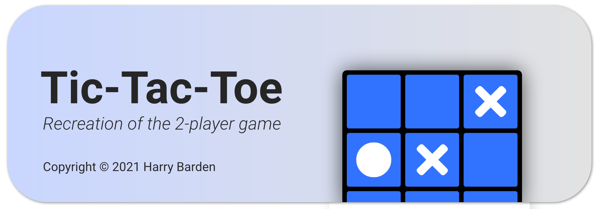
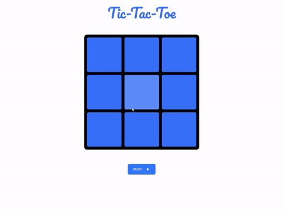

# Tic-Tac-Toe

## What is Tic-Tac-Toe
This is a web-application emulating the two-player game, tic tac toe. Built with Materialize CSS framework and JavaScript. Made in partial fulfilment of the Full Stack JavaScript  <a href="https://www.theodinproject.com/paths/full-stack-javascript" target="_blank">path</a> on **The Odin Project**.

## Installation
 Tic Tac Toe is available live on GitHub [pages](https://bardenha.github.io/Tic-Tac-Toe/).
 
 To run the application locally, follow these steps:
 

 1. Either clone the repository with `git clone https://github.com/bardenHa/Tic-Tac-Toe`, or download the `.zip` and extract it.
 2. Run the application on a local host or open the `index.html` using a browser.

## Usage
Player one will start in the first game with marker `X` and player two will have the marker `O`. For each turn, simply click on the grid to place your marker and the game will automatically check for win//draw scenarios. The reset the game or play again, click on the repective buttons.

If you are unsure about the rules of Tic Tac Toe, check out this [video](https://www.youtube.com/watch?v=USEjXNCTvcc&t=14s).

## Contributing 
When experiencing any problems using the application, please submit an issue. Pull requests are also welcome should the user wish to implement any changes to the application.

## License
This project uses the [MIT License](LICENSE).